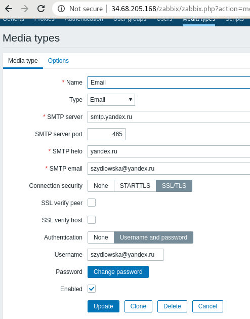

# Zabbix (Maryna Yantsevich' report)

## Bootstraping 2 instances 

  

## Configuring zabbix to work on the server + configiring 2 agent (on the server and on the client)

  

## Playing with dashboard, trigers and items :)

  

##  Setting SMTP server

  

## Adding e-mail for User and configuring alert's type

  

## Here we are

  

