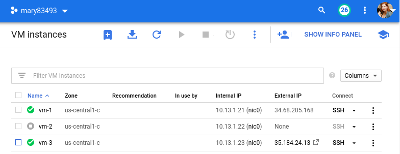
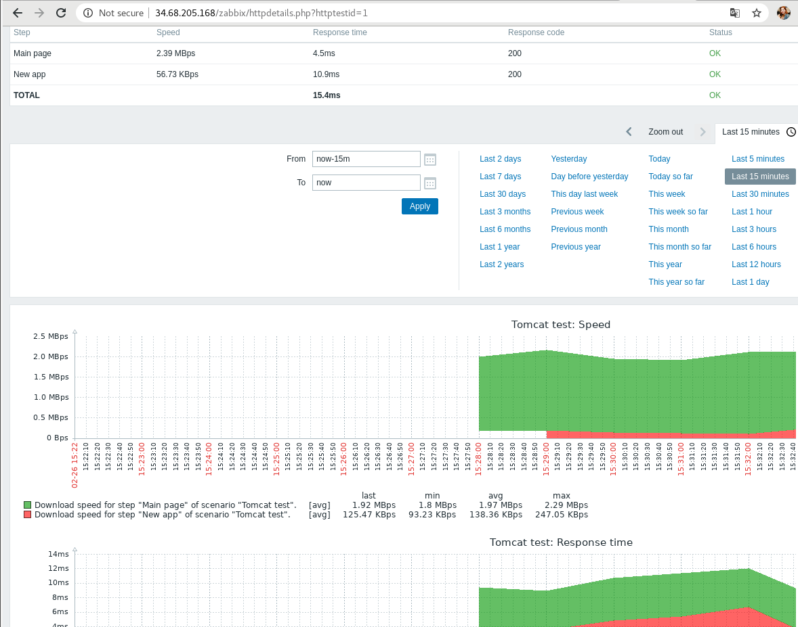
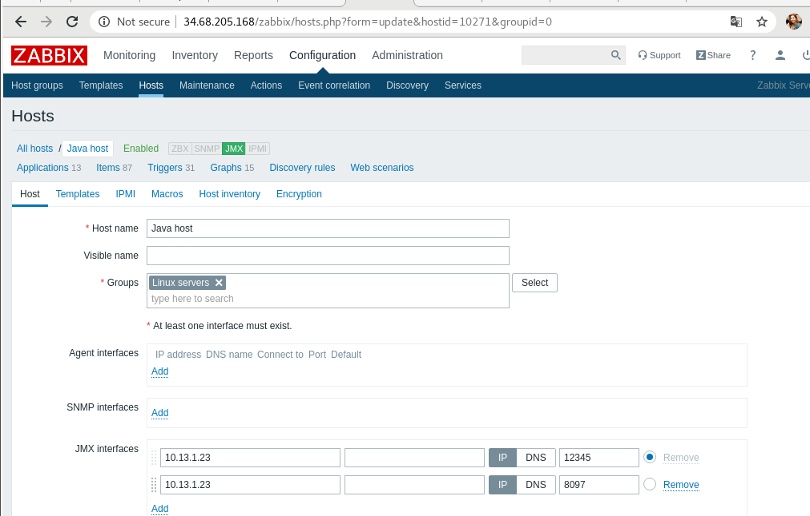
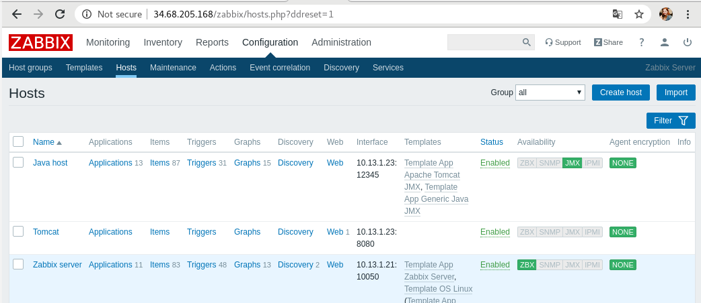
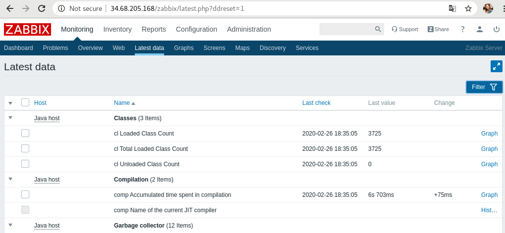
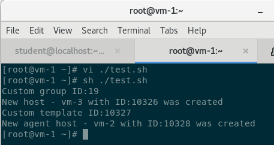
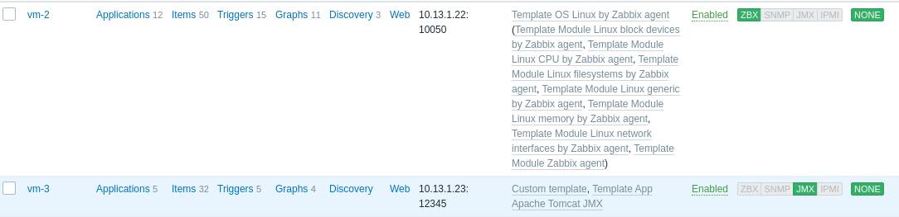
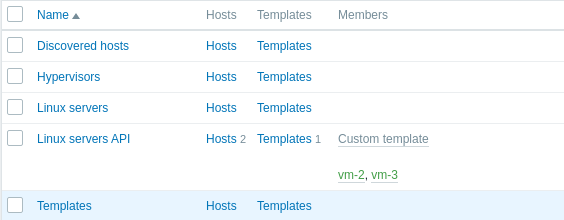

# Zabbix (Maryna Yantsevich' report)

## Working with Web-scenarios for web and JAVA apps

  

  

  

  

  

## Working with API

### Host, Custom group, Custom templated were created

  

### Let's check via UI

  

  

