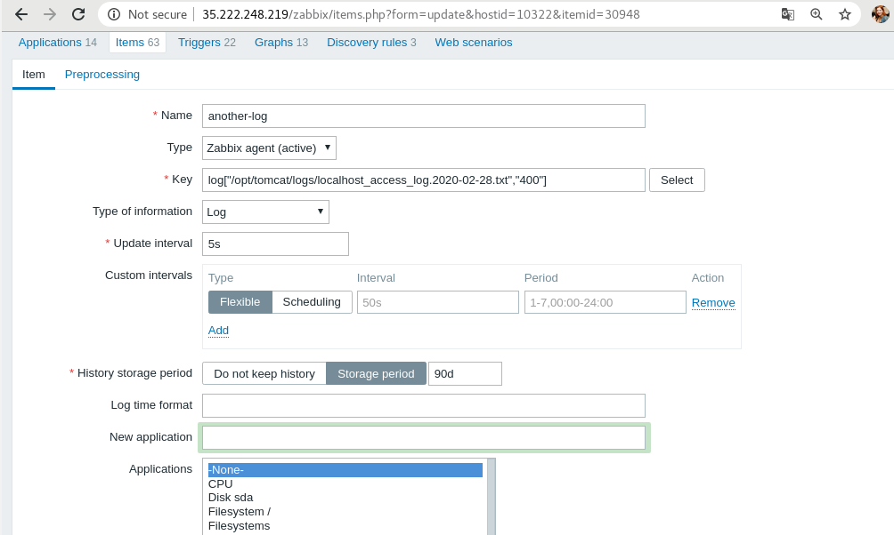

# Zabbix (Maryna Yantsevich' report)

### Step 0 - preparing
1. Create vm
2. Install agent
3. Wite down hostname, give folder permisson
4. Checking agent connection

### Step 1 - adding new item 

  

### Step 2 - checking logs

  

### Step 3 - setting trigger

  

